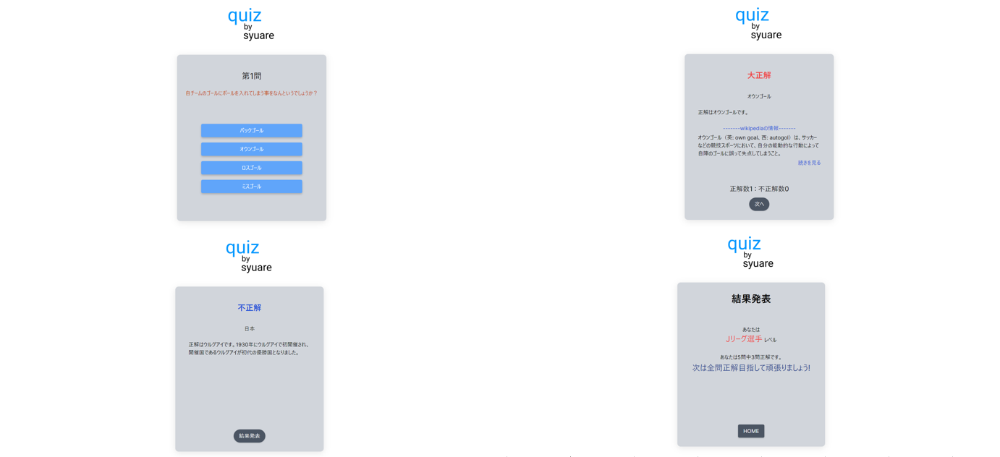
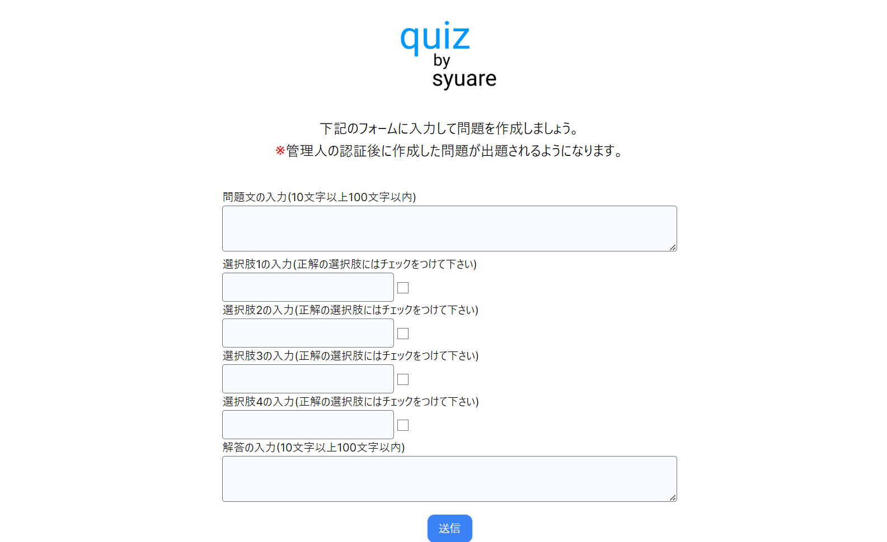
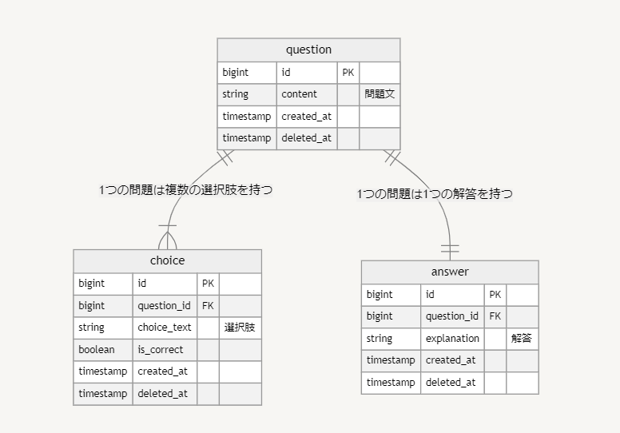

# quiz_by_syuare
**サッカーのクイズを楽しみたい人、知識を身につけたい人に向けた、クイズサービスです。**

# サービスの概要と背景

## サービスの概要
サッカーのクイズをして楽しみたい人、知識を見つけたい人に向けた、クイズサービスです。 
最大5問をランダムに出題され、正解数に応じて結果画面が変わります。 
自分で考えた問題を投稿すれば、その問題をクイズとして出題することが出来ます。 

## このサービスのターゲット
* サッカーのクイズをしたい方
* サッカーのクイズを考えて問題を出題したい方

## このサービスで解決できること
1. 自分が知らないサッカーに関する知識を知りたい。 
2. 自分の知っているサッカーに関する知識を共有したい。

# 画面一覧
 
 
 

## 主な使用技術 
【バックエンド】 
``Ruby on Rails (ver 7.04)`` 
``Ruby (ver 3.12)`` 
``MySQL`` 

【フロントエンド】 
``JavaScript`` 
``Tailwind CSS`` 

【使用ツール】 
``RSpec(テスト)`` 
``wikipedia-client(Wikipediaのデータ取得のAPI)`` 

【インフラ】 
``Docker / Docker-Compose``  

## ER図

## 機能一覧
* クイズの回答と結果の確認
* 問題の投稿機能

--- 

最後までお読みいただきありがとうございました。