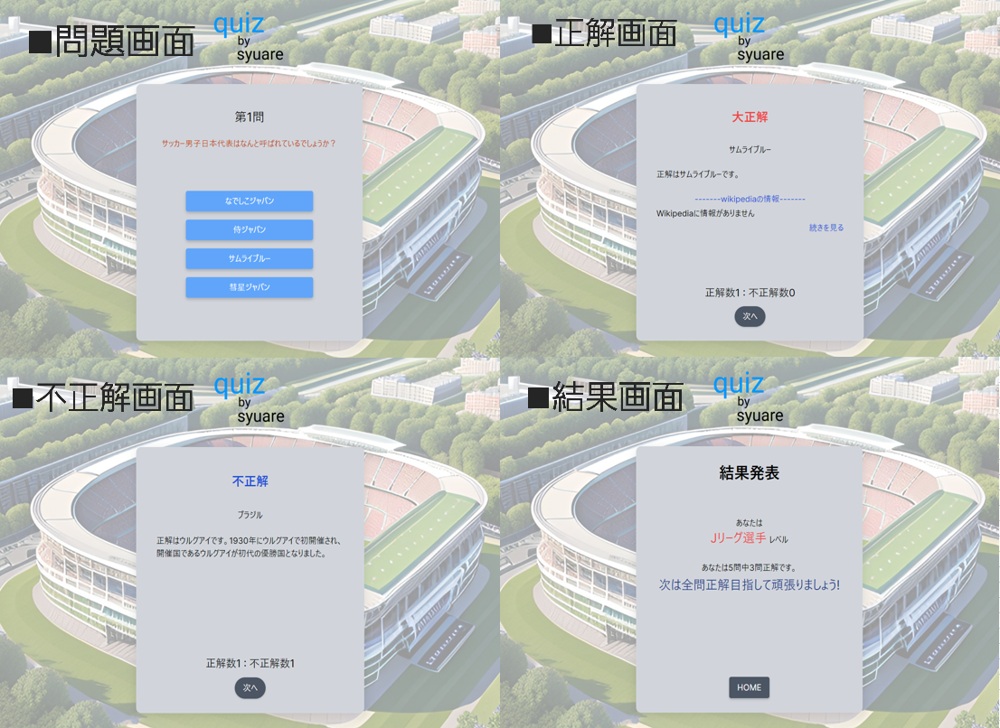
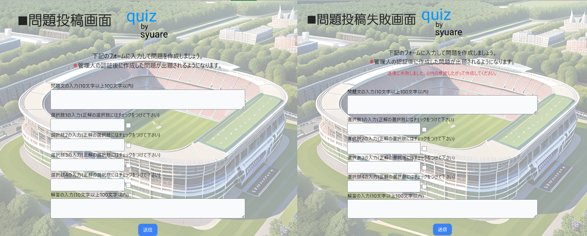

# quiz_by_syuare
**サッカーのクイズを楽しみたい人、知識を身につけたい人に向けた、クイズサービスです。**

# サービスの概要と背景

## サービスの概要
サッカーのクイズを楽しみたい人、知識を身に付けたい人に向けた、クイズサービスです。 
最大5問をランダムに出題され、正解数に応じて結果画面が変わります。 
自分で考えた問題を投稿すれば、その問題をクイズとして出題することが出来ます。 

## このサービスのターゲット
* サッカーのクイズをしたい方
* サッカーのクイズを考えて問題を出題したい方

## このサービスで解決できる課題
1. 自分が知らないサッカーに関する知識を知りたい。 
2. 自分の知っているサッカーに関する知識を共有したい。

# 画面一覧
 
 
 

## 主な使用技術 
【バックエンド】 
``Ruby on Rails (ver 7.04)`` 
``Ruby (ver 3.12)`` 
``MySQL`` 

【フロントエンド】 
``JavaScript`` 
``Tailwind CSS`` 

【使用ツール】 
``RSpec(テスト)`` 
``wikipedia-client(Wikipediaのデータ取得のAPI)`` 

【インフラ】 
``Docker / Docker-Compose``  

## ER図
 
Mermaidを使用して作成 

## 機能一覧
* **クイズを回答、結果の確認**
* **クイズをサイクル管理** 5問目を回答すると結果に遷移し、サイクルがリセットされる。
* **ブラウザバックアラート機能** サイクルが崩れてしまうことを防ぐために、ブラウザバックをした際にアラートを出し、アラートを了承した際にブラウザバックできる。ブラウザバックをした際には、サイクルはリセットされる。
* **問題の投稿機能** ユーザー自信が考えた問題を投稿フォーム投稿すると本サービスの問題として反映することが出来る。 (今後、認証によるクイズの反映機能の追加を検討中)
* **wikipedia API** 正解時に解答の情報をwikipediaから取得し、解答の情報を表示することが出来る。

## 学習予定の技術
【インフラ】
`` AWS Fagate `` 現在学習中 

--- 

最後までお読みいただきありがとうございました。
